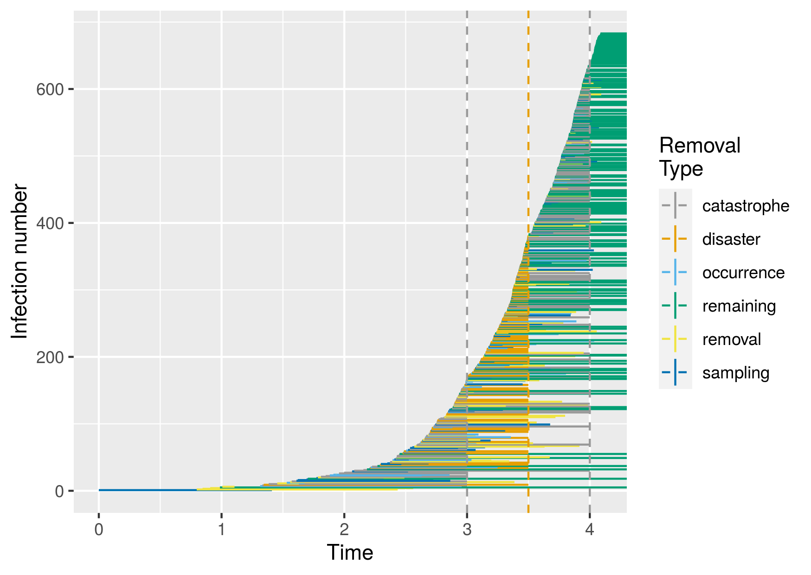
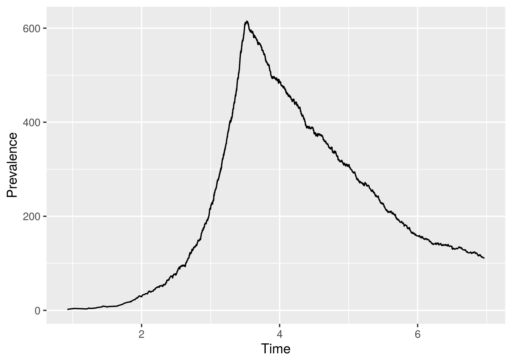

# epi-sim
A tool for simulating epidemics, with a focus on phylodynamics and observation
models.

```
stack clean
stack build
stack test
stack haddock --open --no-haddock-deps
stack exec -- <example>
```

See the Examples section below for details of the examples. The for some nice
visualisations

```
Rscript vis/ltt.R demo-output-observed-events.csv demo-output-ltt.png
Rscript vis/ott.R demo-output-observed-events.csv demo-output-ott.png
Rscript vis/birth-death-lines.R demo-output-all-events.csv demo-output-full-sim.png
```

## Models

1. Birth-Death (see `Epidemic.BirthDeath`)
2. Birth-Death-Sampling (see `Epidemic.BirthDeathSampling`)
3. Birth-Death-Sampling-Occurrence (see `Epidemic.BirthDeathSamplingOccurrence`)
4. Birth-Death-Sampling-Catastrophe-Occurrence (see `Epidemic.BirthDeathSamplingCatastropheOccurrence`)
5. Birth-Death-Sampling-Catastrophe-Occurrence-Disaster (see `Epidemic.BDSCOD`)
6. Inhomogeneous Birth-Death (see `Epidemic.InhomogeneousBD`)
7. Inhomogeneous Birth-Death-Sampling (see `Epidemic.InhomogeneousBDS`)

## Output

The output is a CSV with a header encoding which events occurred when and to
whom: `event,time,primaryPerson,secondaryPerson`. The *primary person* is either
the infecting person or the person who has been removed in some manner, the
*secondary person* is the person who was infected, or this is a missing value.
There are functions to assist in extracting observations from a full simulation:
`birthDeathSamplingOccurrenceObservedEvents`. In the case of a catastrophe event
where multiple individuals may be removed, they are represented as a colon
separated list of identifiers in the `primaryPerson` field.

There is also a script `vis/ltt.R` which creates a lineages through time plot of
the reconstructed tree. Note that for this to work, the output file cannot
already exist.

## Example

### BDSCOD

```
$ stack build
$ stack exec -- bdscod-example
$ Rscript vis/birth-death-lines.R demo-output-all-events.csv demo-output-full-sim.png
```

This should produce something like the following figure



### Inhomogeneous Birth-Death

```
$ stack build
$ stack exec -- ibd-example
$ Rscript vis/full-ltt.R demo-output-all-events.csv demo-output-full-sim.png
```

This should produce something like the following figure



### Inhomogeneous Birth-Death-Sampling

```
$ stack build
$ stack exec -- ibds-example
$ Rscript vis/birth-death-lines.R demo-output-all-events.csv inhom-bds-sim.png
```


The `main` function for this simulation is shown below, it is nearly identical
to the one in the example for the inhomogeneous birth-death simulation. Note
that here we have only considered a varying birth rate.

```{haskell}
main :: IO ()
main =
  let simDur = 7.0
      simTimes = [0, simDur / 2]
      simSR = 1.0
      simDR = 1.0
      simBRs = [4.0, (simDR + simSR) - 0.5]
      simBRTs = zip simTimes simBRs
      simConfig = fromJust $ InhomBDS.configuration simDur (simBRTs, simDR, simSR)
   in do events <- EpiUtil.simulation False simConfig InhomBDS.allEvents
         L.writeFile "demo-output-all-events.csv" (encode events)
         return ()
```

## Development

The desired workflow is to keep a `dev` branch for development with `master`
reserved for code that could be used by others. At the time of writing this is
not the case but will hopefully be so soon.
